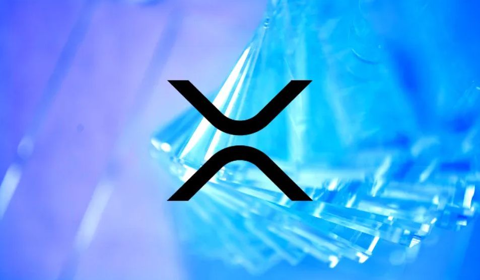

# XRPL Validator 

## Background
Like all decentralized ledgers, the XRP Ledger is a program that lives on a distributed set of servers. These servers run a program called rippled. Every server can follow the network with a local copy of the ledger and submit transactions to the network. A smaller subset of servers contribute to the consensus process that helps to maintain forward progress of the network. These servers are called validators. Any server that runs rippled can operate as a validator by enabling validation.

Validators agree on the set of the candidate transactions to be considered for the next ledger through the consensus process. Each validator evaluates transaction proposals from a specific set of trusted validators called a Unique Node List (UNL). Validators that appear on a UNL are "trusted" not to collude in an attempt to defraud the server evaluating the proposals. In each round of consensus, validators add transactions to their proposals if a threshold number of trusted validators also propose those transactions. The threshold is increased until a supermajority of validators propose the same set of transactions.

Finally, every rippled server independently computes a new ledger version with the new set of transactions. Validators broadcast the hash of the new ledger version to all rippled servers, and if a supermajority of a server’s trusted validators computes the same hash, then the ledger version is considered fully validated.

## Why Run a Validator
Those who operate validators do so because they have a demonstrated interest in the long term health of the network. For example, individuals and entities that rely on XRP for their business operations, all stand to benefit from the continued reliability, stability and performance of the XRP Ledger.

For those more familiar with crypto, the rationale for running a validator is similar to why someone would run a Bitcoin Full Node: by contributing to the ecosystem, one hopes that it will continue to thrive and grow.

Validator operators that appear on a UNL also partake in the governance of the XRP Ledger through voting on fees and amendments, which are proposed changes to the protocol.
